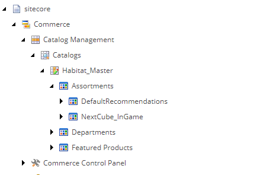

# Sitecore Project X Overview
> 12/21/2019

**The Project** currently runs on Sitecore 9.1, to run it simply run the [docker-compose.yaml](docker-compose.yaml) if you have the correct azure credentials. After an hour of downloading you will correctly have an environment running the bare minimum of Sitecore 9.1 XC taking 5GB a piece per server, and this is a development topology. There are many Sitecore variants and topologies, which change all the time. This is very important because the marketing terms change between versions. And if you read any documentation sometimes the names change or refer to an early version. Here's what the automated build accomplishes and a brief overview of which server differs by config:


```text
 sitecore91.azurecr.io/sitecore-xc-cm:9.1.0-windowsservercore-1903-v1.3
 \__________________/ \_______/ \___/ \____/\_______________/\___/\___/
           |              |       |     |            |         |    |
        ACR URI       sitecore server sc version core/nano  kernel custom tag based off latest release (latest git tag, will not push to ACR without a tag)
```


##ACR URI

This is process is all documented in the dev-ops repository, not really relevant but there were a lot of things that went into it and I basically used bash history to document it end to end.

1. Setup a a custom Azure build server (Self Hosted Build Agent)[SELF-HOSTED-AGENT.MD], this is in its own repository. Basic documentation with passwords omitted. This is because the build exceeds the the standard Azure build server (with no-cache enabled on docker). It is about three hours for a build to work.
2. This requires a service connection between Azure Build Pipelimes and ACR, this is documented in my repo, but it just works. It runs off a service principal.
3. This requires a service connection between the build pipeline and whatever term Azure uses for git.
4. Custom Azure build pipeline that builds off a push off master for the Sitecore Build repo.

**Sitecore**

> For some reason you need to put the word Sitecore everywhere, so I just went with it.

**Server (And Base Build)**

 ***Sitecore 9.1 XC XP0***

| Server             | Shared Config  | Separate Code  | Custom Code?    | Explanation															 |
| -------------------|----------------|----------------|-----------------|-----------------------------------------------------------------------|
| xc-cm              | N (CM/CD)      | Shared (CM/CD) | Shared (CM/CD)  | Authoring environment      											 |
| xc-cd              | N (CM/CD)      | Shared (CM/CD) | Shared (CM/CD)  | Delivery environments                                                 |
| xconnect           | N              | N              | N               | No idea what this does but it requires separate environment configs   |
| solr               | N/A            | N/A            | N/A             |																		 |
| mssql              | N/A            | N/A            | N/A             |                                                                       |
| identity server    | N              | Y              | Y               | IdentityServer4 this is broken OOTB                                   |
| xc-plumber         | N              | N              | N               | Commerce debugging site                                               |
| xc-authoring       | N              | Y              | Y               | Where users and plugins edit commerce "entities" that go to Sitecore  |
| xc-shops           | N              | N              | Y               | Where users create shops (we just have one)                           |
| xc-ops             | N              | Y              | Y               | Backplane that ties all the commerce servers together                 |
| xc-minions         | N              | Y              | Y               | A daemon to run jobs like "update inventory"                          |
| xc-identity server | NO IDEA        | NO IDEA        | NO IDEA         | 99% sure this proxies dotcore objects to dotframework objects         |

1. Terminology: This is confusing and the documentation provided by Sitecore contradicts itself. There's multiple setups and topologies. In general for builds environments there is:
* XP (CMS only)
* XM (Standalone, no CD/CM)
* XC (Commerce)
> Ignore the term XM but this build is XM since we have just an authoring environment and not delivery node as the only difference is config and not code. For topology this gets even more complex as the same acronyms are used even if it applied to XC:
* XP0
* XP1
> Ignore the fact the term is "XP" as it applies to XC also. XP0 doesn't break apart the services as much as XP1 does. See [the Azure guide](https://doc.sitecore.com/developers/90/sitecore-experience-manager/en/sitecore-configurations-and-topology-for-azure.html). The project runs XC on an XP0 topology for dev, and for production will run XC with an XP1 topology. The difference is not in code but how configs are broken out and how services are on separate servers.

2. Everything needs certs to talk to each other over SSL and they each need thumbprints from each other to validate themselves. I have this all automated, you don't have to worry about, there are self signed certs.

4. The standard way to setup Sitecore is called SIF (just a jumble of powershell scripts), and it is buggy and doens't really work. It requires localhost to install all these IIS/servers services. In my docker build process you'll see I literaly create intermediate containers, do a docker compose so that the servers can all talk to each other. Sitecore made a mistake and you can now do a Sitecore docker build (or otherwise) without SIF even though SIF is the way you're supposed to do it, but we're on 9.1. If you want to run it locally without docker and make a mistake where a catalog is imported incorrectly you have to redo the entire setup. This is not an ideal envnironment, 9.2 fixes this. Docker builds do not need complex conmpose steps to create images so I will move to this.

5. Docker containers on windows cannot mount non-empty directories. To get around this there's a ***C:\Workspace*** with a watch folder that copies things to inetpub. On the host this appears as an empty directory. Once you pull down the CM/CD repo due to the complex nature of the watch directory on first startup it is easier to publish the site to empty folder, then bring up the containers. After this is complete publishing normally works fine for non-persistent data. This is not Sitecore but a Docker/Windows filesystem driver overlay issue.

6. Similarly, if a file is in the base image you can't see it unless you ```docker exec -it sitecore_commerce_1 ps``` or whatever container needs debugging. I have VIM installed on all the servers and logs get exported. This was only a problem when I was building the base images or had to do some deep debugging. You can't attach volumes like network shares either. If you have an idea on this one I'm all for it. I tried SFTP and just have it anonymous for dev, but giving anonymous root access is where I started fighting the system. Plus you have to figure out the IP for the server which changes, etc. I've come to the conclusion that if you're messing with the base image, the base image needs to be changed. This is only a problem for me when I was trying to extract config files I don't need for development but I'd need to do an xlst/json transform to get a proper build going between environments. I'm ignoring that for right now and it wouldn't be a problem if Sitecore has their own weird config system. Plus each single server listed has config files (they're all separate IIS sites/services...) and of course ```dotcore``` supports environment variable injection but some of these apps are dotcore and some are .NET Framework 7.2.

7. All the servers have watch folders (empty volume you can mount), you publish and you're done. I have a "CreateDirs.ps1" script to aid this.

**Servers**
1. The XC-CM part is important. Basically I simplified Sitecore terminology but I've broken the build up into servers that just need config changes to those that need code changes. CM is the authoring environment and CD is the delivery server. The code base is the same but the configs are different. This is a multistage build. Technically this is a "standalone" build so I should use CM but the term "standalone" or XM. Again, this sounds excessive to explain but the terminology in the documentation refers to these interchangeably. I just saved you a lot of time figuring it out. This is one of the many things that makes Sitecore confusing. Especially when the documentation itself refers to the same thing by different terms. I've taken a lot of documentation and once I realized what they were talking about literally rewrote it. A lot has to do with it coming from Russians writing. There's an important distinction between CM/CD/XM (aka Standalone) because in configs you tell it what it is and then other configs will do things like not expose themselves because of this. The authoring environment, for instance, is actually in the CD (delivery endpoint) but if you change the config value to CD it'll turn off everything that a public facing user shouldn't get it. I made a chart that shows the servers, and a brief description. **IMPORTANT** Sitecore 9.1 is the first to implement a microservice architecture while still having a monolithic giant CM/CD/XM server that does the CMS stuff but only difference is configs. I'm omitting XM right now because the differences are minor between CM but you'll see it in documentation. Here's what I currently build out and what is code vs config. So configsets are basically separate.

2. IdentityServer4 doesn't run well and is all closed source. To get it working I have to have Traefik (reverse proxy), and assign it a DNS address. This is an IdentityServer4/Docker not Sitecore issue. This is because it sees calls in the cluster as "localhost" so you'll get loopback issues. This drove me crazy see (How can I use IdentityServer4 from inside and outside a docker machine?)[https://forums.docker.com/t/how-can-i-use-identityserver4-from-inside-and-outside-a-docker-machine/32110], since we don't have access to Sitecore CMS or their IdentityServer4 implementation we can't fix it. This is a known "todo" in their bug list, and really if the IdentityServer4 were setup to spec we could set the IssuerUri which isn't exposed to us. The only way I managed to get it working was the reverse proxy and patching their version of IdentityServer4. I omitted the Traefik portion of the config.

3. MSSQL/Solr I'm skipping those as you know what they are, also I turned off the need for Redis.

4. Plumber a debug utility for commerce server that makes more sense if you have multiple catalogs/virtual catalogs/multiple tenants/complex order processes that you need to debug. For reasons below we won't really be needing it for our purposes.

5. Commerce Authoring (which itself hosts BizFx/Ops/Shops/Minions is where it gets confusing. They're all separate servers and IIS instances but they have the exact same files. Prior to 9.1 (possibly 9.0, this is important), they were just one big server. Then they found Sitecore has really, really poor performance. Authoring has a completely different interface from Sitecore and is where you can do all kinds of complicated commerce things. Bundles, products in multiple categories along with creating catalogs. For complexity think of it as you're a huge retailer and you own multiple shops. Not only can you have different products in different countries or regions, you can have multiple tenants on the front-end side. An example, L-Brands used DemandWare (Salesforce) and they are a large retailer, they owned Express, Victoria Secrets, were global and would have deals and share products between catalogs. We don't have to worry about this, first it is basically content and we aren't entering products. The hard part comes in the fact we have to deal with very complex calls to this server, that are incredibly abstract just to get a product because the product can be coming from anywhere. More detail will be below in the development section.

To continue on this, because it was all considered one big site and not split up into 4 sections, documentation will say "publish to Authoring" but what it might mean is publish to Minions. Even though you have to have all four separate IIS servers running (and Authoring also hosts BizFX on port 4200 to make things more fun, that actually publishes to Sitecore via a "Sitecore Service Proxy" (this is just an assembly) that translates the dotcore objects into something Sitecore aka .NET Framework 7.2 can read, which doesn't make sense because Sitecore uses .NETStandard 2 which is supposed to be an interop between dotcore and .NET Framework so just assume Sitecore didn't adhere to .NET standards at somepoint and probably created their own classes that overwrote .NET behavior). In anycase the only time you'd publish a VS to this is if you needed to do something like manipulate how default cart behavior works and create a plugin. Anything in a cart or order no longer becomes a Sitecore item, meaning you need to make calls in a different way.

What's confusing is that since they all used to be one big IIS site, a lot of people publish to all the sites which work if you're not scaling them out (like multiple minion servers, which we won't need), but if you overwrite everything you need to manually go in add find the config with the SSL thumbprint, which varies with each build or at least between servers and then manually add the plugin to a giant 2000+ line JSON file. This will make more sense in a bit. 

With the attached simple docker-compose.yaml you'll have a complete site setup, it'll already have a sample catalog "Habitat_Master" ```bootstrapped```. Meaning if you installed the SIF way (keep in mind docker is running a SIF installation, which is why I have to do a docker-compose during the base build, because I cannot create the images by just building a Dockerfile).

[]

On the catalog itself there's a dropdown that lets the user select what template they want to use for categories and products (we will not be using things like product variants or bundles).

##Dynamics/AX7

Sitecore delivered a series of plugins to integrate into Dynamics AX7. They included the following to install:

**Sitecore Package**

A "package" that consisted of a series of assemblies and configs. These override the pipeline calls to D365 on the CM/CD server. The call for the developer remains the same, it just intercepts the call "add to cart" and puts it in Dynamics. This is not in Docker or in a build script, but since I needed to reference it in the web project I just created a package in a private repo, it was stupid simple to do. Azure makes doing things like that really easy.

**Dynamics Package**

An IdentityServer4 that I call the D365IdentityServer, to distinguish it from the others. It resides on the D365 instance and requires what's known as a Azure Active Directory Application Registration. That's scripted and part of the build now. This is a proxy between Sitecore, the Identity Server and Dynamics. The delivered solution had hard coded values for the client ID and secret (needed by D365 and Dynamics to communicate). The instructions were to modify the ```clients.cs``` file at build time, but I made the easy decision to abstract them into the config file. Again, this is being built as a separate pipeline agent, and on a commit to master will uninstall the proxy, reinstall then use the Azure agent. Just for the Azure Active Directory Application Registration I included what I scripted (D365IdentityServer)[D365IdentityServer.md]. I keep it as a README in the Identity Server in case something changes, plus since I used powershell history all I need to do was literally copy and paste it. There's a lot more DevOp things like this that I pretty studious about doing because you have to do it by the commandline anyway and I probably would forget in 2 months when suddenly they want it on a different server, now it isn't a fire I just trigger a build or worst case look at the README. There's additional steps in Dynamics that basically takes syncs with the D365IdentityServer, but I make the Dynamics team do that, even if it means screenshare and telling them what to click. It would only happen in a new Dynamics install or if for some reason the D365IdentityServer is upgraded/client secret changed.

**Sitecore Reference Storefront**

This is the problem. It is out of date and 4 years old right now. It is actually online and here is an example of a [controller](https://github.com/Sitecore/Reference-Storefront/blob/master/Storefront/CF/CSF/Controllers/CatalogController.cs), it is kind of crazy, but it has a lot of templates built in, the designs we used like any other project, do not match 1:1, but they're close. Ignoring commented out code, code that says things like "TODO: This needs fixing," the only way I was planning on getting this done was if this worked mostly OOTB and the front-end matched this which was done in an old version of jQuery. Compare that to their [modern Habitat Commerce Example](https://github.com/Sitecore/Sitecore.HabitatHome.Commerce). The installation instructions for this and the Dynamics depedencies were impossible to automate. Their example was so old, I was in depedency hell working against 9.1. Plus they finally showed me how they installed it and I realized they had Dynamics/D365IdentityServer/all Sitecore Servers installed locally as local host. They took 8.2 plopped in a Sitecore 9.1 DLL and then showed it working in a completely artificial environment. It also heavily relies on all the logic to be in the views, it is hard to tell from the code by the views actually invoke the template. Compare this to how I wrote the homepage, which did not include products:

```csharp        
public ActionResult Banner()
        {
            return View("~/Views/Shared/Banner.cshtml", _mvcContext.GetDataSourceItem<Banner>());
		}
```

I have a folder in Sitecore with banners, and on the page the user can choose which of the banners they want or create a new one which binds to a POCO model:

```csharp
    public interface Banner
    {
        Image Image { get; set; }
    }
```

All I had to do was integrate basically an ORM, the interface name doesn't matter, but if there's a field called Text/Image/Link it binds it and in the view you have ```@RenderImage(x => x.Image)```.

That works, and as I was typing this I realized how Sitecore Commerce works, and it clicked once I got around it. I got confused by the reference project but it is kind of stupid how it does things. So the whole idea is that they made it so you don't need a developer. Sitecore templates are not touched by anyone but developers so I can do the strongly typed things like above. In fact the default is that non-developers are actually not able to touch templates and they just introduced the "Update Templates" ability. Well for some reason Sitecore really buries how it calls things. [This example](https://hachweb.wordpress.com/2018/07/15/sitecore-xc-9-0-2-walk-through-extending-product-definitions-with-custom-fields/) explains the conceptual problems I was having. Sitecore doesn't have very good documentation, but basically renderings are used to select items that are templated. Again, you put a banner on a page, then you select the item associated with that. It'll have a field like Image and you select the image you want to use in the CMS. All I have to do is create a template with a field Image and point it to where Images are stored and then do above.

But with this version of Sitecore we're using they give you the ability to add properties to "entities" which are Commerce items. In Sitecore they're just items and my code should work. Well they developed a "Composer" so you can extend it in the Sitecore Commerce Authoring server, then update the template. Then they have renderings based on Rich Text, Text and Image or whatever the most basic building blocks are. You'd add a rendering and put the key in there "Description2" select Text in a drop down and it'd be rendered on the page. All so you can say that you're able to add properties to products without needing developers. These people don't even know HTML. The version I was given, the reference project, was written before all this was possible. But even so how often ar ethey going to be changing product properties, and then the whole idea of having a templated component based CMS is so they can't jack up the html. Plus that's based on SXA.

And we're importing all data from Dynamics, so even if they show up as "entities" and "items" in Sitecore I don't know exactly how the import process works. Anyway, this explains why I'm getting conflicting information. Okay lets ignore this and say that for now, I don't think we can use it as I don't even have schema for the products, the client doesn't know HTML and it makes it all moot.

**Sitecore Sync**

We were given a tool called Sitecore sync. It works in a console app and imports data from D365. The only "gotcha" that the documentation fails to mention is that it marks the data in Dynamics as published meaning if you run it again it won't return products that were sent. I'm sure there's a good reason for this, and it needs to be moved into a minion or something. But I don't care about that.

**Sitecore Import**

Okay once the "sync" happens I have a bunch of JSON files that then need to be imported into Sitecore. This dies with an OData error, Sitecore says they won't diagnose it because it works on their local mahcine. I'm pretty sure they just built it against the wrong version of Sitecore. So I need help with that because they want to see the complete purchase process and I can't even import the data they gave me (which is not the complete schema, which is another problem, they're not using product variants for products so we couldn't use the Reference Project or the new project without a lot of customization. No idea why they decided that, we'd have to write some sort of ETL that converts "linked products" to product variants because you eventually get to a page where you have like bracelets and you can choose colors, etc.

**HTML**

It is all static and there's no gulp or anything and they didn't use a framework.

Anyway If I ditch the Reference project and its complexity and do it from scratch we'd have to do what I'm doing now which is copy code selectively. 

- We'd also have to rewrite the URL resolution. Products exist outside of the Sitecore content tree, Sitecore also changes names from like " " to "-" and a bunch of other little things. The reference project is actually broken.
- Registration and any transactional elements custom
- Figure out how it converts guest users to non-guest users and cart still is there.
- Do wish lists
- All other things that come with commerce
- This isn't actually too bad because Wish Lists is OOTB with Sitecore so we'd just be like Commerce.Connnect.AddWishList(whateverusersubmitted).
- Same with add to cart but again we're just making calls to pass data around

We're not making a custom CMS or e-commerce it'll just be hooking up data to HTML which will need to be rewritten. The reference project is a mess and I hate to rewrite but I think we'll be running up against something not made for the version we're using. I could go into more detail but we've both done e-commerce projects and those were completely custom. We have a build system in place, integration is in place. I want to move to Sitecore 9.2 (I already have that building and since it is from Sitecore it has a lot of things mine doesn't since I didn't have tie like production and development stages where you can easily hook up VS debugger, mine is just development).

I can make a more coherent list, they won't like changing to 9.2, nor will they like ditching reference project but I don't think they knew the composer thing was now an option.

Besides the identity server, which I have a work around for, docker can't be the issue as I imported the catalog using docker. I'm just coming up against a lot of "should've used that"